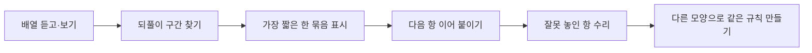

# Pattern Unit Engine Room

> 한국어 서비스명: **규칙 단위 기관실**  
> 문서 상태: 설계 확정 전 검토본 · 구현하지 않음  
> 작성일: 2026-08-26

## 1. 프로젝트 개요

| 항목 | 설계 내용 |
|---|---|
| 대상 | 초등 1~2학년 |
| 교과 | 수학 |
| 핵심 질문 | 되풀이되는 모양에서 가장 짧은 규칙 단위를 어떻게 찾고 다른 방식으로 나타낼까요? |
| 한 차시 권장 시간 | 15~25분 |
| 실행 형태 | 서버 없는 저학년용 정적 조작 웹앱 |
| 핵심 산출물 | 반복 단위 표시, 다음 항 예측, 오류 수리, 규칙 번역 |

학생은 길게 늘어선 모양을 외워 이어 붙이는 대신, **가장 짧게 되풀이되는 한 묶음**을 찾아 기관차의 동력 단위처럼 표시합니다. 같은 규칙을 색·모양·소리 없는 기호·동작 그림으로 바꾸어 보며 겉모습과 구조를 구별합니다.

## 2. 설계 원칙

- 저학년이 긴 설명을 읽지 않아도 한 화면에서 한 행동만 수행하도록 합니다.
- 색상만으로 규칙을 만들지 않고 모양·무늬·기호를 함께 사용합니다.
- 반복 단위를 먼저 찾은 뒤 다음 항을 예측하게 하여 단순 복사를 줄입니다.
- 드래그 정밀도를 요구하지 않고 큰 선택 버튼으로 조작할 수 있게 합니다.
- 속도·점수·연속 정답을 경쟁 요소로 사용하지 않습니다.

## 3. 교육과정 연계와 학습 목표

- `[2수02-01]`: 물체, 무늬, 수 등의 배열에서 규칙을 찾아 여러 가지 방법으로 나타내기
- `[2수02-02]`: 자신이 정한 규칙에 따라 물체, 무늬, 수 등을 배열하기

| 수준 | 학습 목표 |
|---|---|
| 기억·이해 | 되풀이되는 한 묶음을 찾아 말하거나 표시합니다. |
| 적용 | 반복 단위를 이용해 다음 항을 이어 갑니다. |
| 분석 | 같은 자료에서 너무 긴 단위와 가장 짧은 단위를 구별합니다. |
| 창안 | 같은 반복 구조를 다른 모양이나 기호로 표현합니다. |

## 4. 기존 앱과의 차별성

| 비교 대상 | 기존 앱의 중심 | 이 앱의 고유 중심 |
|---|---|---|
| 분류 기준 뒤집개 | 기준에 따라 같은 자료를 여러 무리로 나눔 | 순서 속에서 되풀이되는 최소 단위 찾기 |
| 십 묶음 택배 터미널 | 열 개씩 묶고 푸는 자릿값 조작 | AB·AAB·ABC와 같은 반복 구조 표현 |
| 수 배열 관련 활동 | 수의 크기나 계산 규칙 | 색·모양·기호 사이에 같은 규칙을 번역 |

## 5. 핵심 학습 흐름

## 6. 단계별 미션

| 단계 | 활동 | 예시 구조 |
|---|---|---|
| 1. 동력 묶음 찾기 | 괄호 후보 중 되풀이되는 가장 짧은 묶음 선택 | AB, AAB |
| 2. 다음 칸 켜기 | 빈칸 하나 또는 두 개를 선택하여 이어 붙이기 | ABB, ABC |
| 3. 고장 칸 찾기 | 규칙을 깨뜨린 한 칸을 찾아 바꾸기 | ABAB**B**B |
| 4. 외형 바꾸기 | 모양 규칙을 기호나 사물 그림으로 번역 | ○△ → 🚃⭐ |
| 5. 내 규칙 운행 | 2~3개 항으로 단위를 만들고 반복 | 자유 AB·AAB·ABC |

증가하는 규칙과 복잡한 수 규칙은 MVP에서 제외하여 반복 단위 개념을 선명하게 유지합니다.

## 7. 화면 및 상호작용

| 화면 | 주요 요소 | 학생 행동 |
|---|---|---|
| 출발역 | 큰 미션 그림, 짧은 음성·문자 안내 | 시작 선택 |
| 기관실 | 칸 배열, 단위 괄호 후보, 다시 듣기 | 후보 선택 |
| 수리실 | 고장 표시, 바꿀 항 후보 | 칸 선택 후 교체 |
| 번역실 | 왼쪽 원래 규칙, 오른쪽 새 재료 | 대응 항 선택 |
| 운행 확인 | 반복 재생, 규칙 말하기 문장 | 결과 확인·수정 |
| 활동 도장 | 완료한 학습 행동 아이콘 | 다시 하기 또는 종료 |

화면당 선택지는 3~4개 이하로 유지하고, 문장은 한 번에 두 줄을 넘기지 않는 것을 기본으로 합니다.

## 8. 규칙 판정 모델

- 배열을 의미 없는 내부 ID의 연속으로 저장하고 색·그림과 분리합니다.
- 가능한 주기 길이를 검사해 전체 배열을 반복 생성할 수 있는 가장 짧은 단위를 찾습니다.
- 일부가 빈 배열에서는 이미 보이는 항과 일치하는 후보를 판정합니다.
- 자유 규칙 만들기에서는 최소 두 번 반복되어야 `되풀이되는 규칙`으로 인정합니다.
- 하나의 외형을 다른 외형으로 번역할 때 항 사이의 일대일 대응과 순서를 함께 확인합니다.

## 9. 피드백과 평가

| 평가 요소 | 관찰 증거 |
|---|---|
| 단위 인식 | 가장 짧은 반복 묶음을 선택함 |
| 예측 | 단위를 사용해 빈칸을 이어 감 |
| 오류 찾기 | 규칙을 깨뜨린 위치와 바꿀 항을 찾음 |
| 표현 전환 | 겉모습이 달라도 같은 순서를 유지함 |

오답 피드백은 `처음부터 다시`보다 단위를 색 테두리로 한 번 나누어 보여 주고 다시 선택하게 합니다. 힌트 사용도 실패가 아니라 전략 사용으로 기록합니다.

## 10. UI·접근성 설계

- 48px 이상의 큰 터치 영역, 짧고 일관된 동사, 충분한 여백을 사용합니다.
- 색각 다양성을 위해 모든 항에 모양과 촉각을 연상시키는 무늬를 함께 표시합니다.
- 필수 버튼 `한 묶음 찾기`, `운행하기`에만 `gi-pulse` 아우라를 적용합니다.
- 모션 감소 설정에서는 열차 이동 대신 칸별 테두리 전환으로 반복을 보여 줍니다.
- 안내 음성은 선택 기능이며 같은 내용을 항상 문자로 제공합니다.
- 스크린 리더가 “첫째 칸, 별 모양”처럼 순서와 항을 함께 읽게 합니다.
- 드래그, 시간 제한, 빠른 더블 클릭을 요구하지 않습니다.

## 11. 기술 구조 설계

- Vite + React + TypeScript 기반 정적 SPA를 권장합니다.
- 규칙 판정 함수, 시각 테마, 미션 데이터, 문구·음성을 분리합니다.
- 오디오를 제공할 경우 외부 TTS 호출 대신 검수된 로컬 음원을 사용합니다.
- 서버, 계정, 광고, 외부 AI, 학생 이름 입력을 사용하지 않습니다.
- 진행 저장은 기본으로 끄고, 기기 안에서 이어 하기 옵션만 제공합니다.

## 12. 정서·개인정보 안전

- 오답 횟수, 속도, 연속 성공을 공개하거나 순위화하지 않습니다.
- 자극적인 실패음과 화면 흔들림을 사용하지 않습니다.
- 직접 만든 규칙에 이름이나 사진을 요구하지 않습니다.
- 음성 안내는 재생만 하며 학생 음성을 녹음하지 않습니다.

## 13. MVP 범위

### 포함

- AB·AAB·ABB·ABC 구조 미션 20개
- 단위 찾기, 이어 붙이기, 오류 수리, 외형 번역
- 버튼 기반 자유 규칙 만들기
- 문자·선택 음성 안내, 접근성 설정

### 제외

- 증가 규칙, 곱셈 규칙, 복잡한 수열
- 학생 간 작품 공유
- 음성 인식과 자유 그림 업로드
- 캐릭터 상점·포인트 경쟁

## 14. 완료 기준

- 모든 미션이 색을 구분하지 않아도 해결 가능합니다.
- 드래그 없이 터치·키보드만으로 전 과정을 완료합니다.
- 학생이 반복 단위를 찾고, 이어 붙이고, 다른 모습으로 번역하는 활동을 각각 수행합니다.
- 자유 생성 규칙은 두 번 이상 반복되지 않으면 이유를 알려 주고 수정 기회를 줍니다.
- 320px 화면, 200% 확대, 모션 감소, 스크린 리더 구조를 점검합니다.

## 15. 업데이트 내역 버튼 설계

화면 오른쪽 아래의 작은 `업데이트 내역` 버튼은 보호자·교사가 열 수 있도록 명확한 문자 라벨을 사용합니다.

| 날짜 | 구분 | 내역 |
|---|---|---|
| 2026-08-26 | 설계 | 최초 설계 문서 작성 |
| 구현일 입력 예정 | 개발 | MVP 구현과 저학년 사용성 검토 후 실제 날짜 기록 |

## 16. 이번 문서의 경계

학습 활동과 화면 구조만 설계했습니다. 캐릭터 제작, 오디오 녹음, 코드, 테스트, 배포, 아카이브 등록은 진행하지 않습니다.
